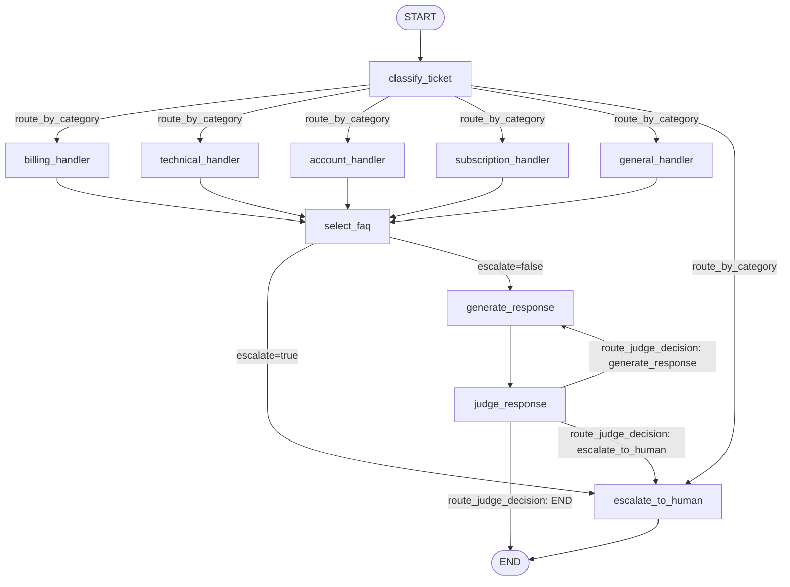

# Workflow Graph

Source: `app/workflow/graph.py`

```mermaid
flowchart TD
    START([START]) --> classify_ticket

    classify_ticket -- route_by_category --> billing_handler
    classify_ticket -- route_by_category --> technical_handler
    classify_ticket -- route_by_category --> account_handler
    classify_ticket -- route_by_category --> subscription_handler
    classify_ticket -- route_by_category --> general_handler
    classify_ticket -- route_by_category --> escalate_to_human

    billing_handler --> select_faq
    technical_handler --> select_faq
    account_handler --> select_faq
    subscription_handler --> select_faq
    general_handler --> select_faq

    select_faq -- escalate=true --> escalate_to_human
    select_faq -- escalate=false --> generate_response

    generate_response --> judge_response

    judge_response -- route_judge_decision: END --> END([END])
    judge_response -- route_judge_decision: generate_response --> generate_response
    judge_response -- route_judge_decision: escalate_to_human --> escalate_to_human

    escalate_to_human --> END
```
