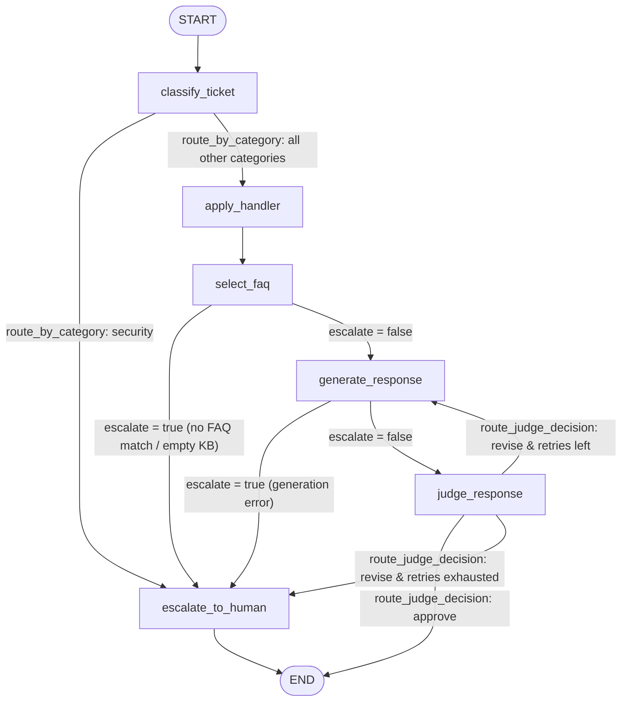
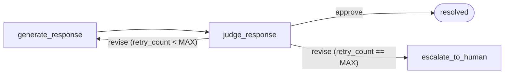

# Workflow Graph

Source: `app/workflow/graph.py`

This diagram reflects the **actual** compiled LangGraph state machine. There is a single
`apply_handler` node that looks up category-specific constraints from a dictionary — the
categories are *not* separate graph nodes.

## Node / edge overview

## Edge types

| From | Router function | Destinations |
|------|----------------|--------------|
| `classify_ticket` | `route_by_category` | `apply_handler`, `escalate_to_human` |
| `apply_handler` | *(direct edge)* | `select_faq` |
| `select_faq` | `_escalate_or("generate_response")` | `generate_response`, `escalate_to_human` |
| `generate_response` | `_escalate_or("judge_response")` | `judge_response`, `escalate_to_human` |
| `judge_response` | `route_judge_decision` | `END`, `generate_response`, `escalate_to_human` |
| `escalate_to_human` | *(direct edge)* | `END` |

## The judge retry loop

`judge_response → generate_response → judge_response` is the self-correction loop. It repeats
until the judge approves, or until `retry_count` reaches `settings.MAX_JUDGE_RETRIES` (default `2`),
at which point the ticket escalates.

